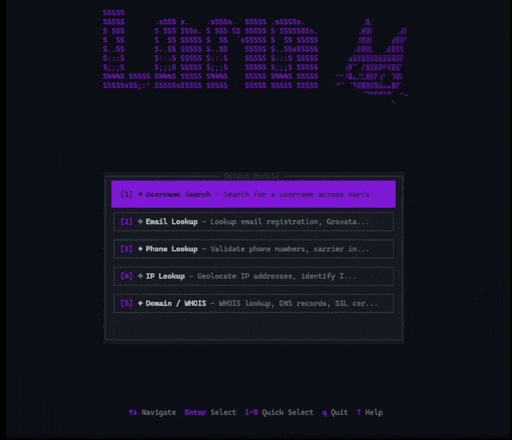

# ⏾ Luna

**OSINT reconnaissance suite — search usernames, emails, phones, IPs, and domains.**

Luna is a comprehensive OSINT toolkit featuring 5 modules for investigating digital footprints across the web.

---

## ☆ Features

| Module | Description |
|--------|-------------|
| ✦ **Username Search** | Search 150+ websites and social platforms |
| ✧ **Email Lookup** | Validate emails, Gravatar, social media registration |
| ✦ **Phone Lookup** | Carrier info, messaging apps, data aggregators |
| ✧ **IP Lookup** | Geolocation, reputation, reverse DNS, port scan |
| ✦ **Domain / WHOIS** | DNS records, SSL certs, subdomains, tech stack |



---

## Quick Start

1. Download and unzip the .zip from `Releases`
2. Run `luna.exe`
3. Select a module (1-5)
4. Enter your query and press **Enter**

---

## Controls

### Module Select
| Key | Action |
|-----|--------|
| `↑/↓` or `j/k` | Navigate modules |
| `1-5` | Quick select module |
| `Enter` | Select module |
| `?` | Help |
| `q` | Quit |

### Input Screen
| Key | Action |
|-----|--------|
| `Type` | Enter query |
| `Enter` | Start scan |
| `Tab` | View/edit site list (Username only) |
| `Esc` | Back to module select |

### Site List (Username Module)
| Key | Action |
|-----|--------|
| `↑/↓` or `j/k` | Navigate |
| `Space` | Toggle site on/off |
| `a` | Enable all sites |
| `n` | Disable all sites |
| `Tab/Esc` | Back |

### Results
| Key | Action |
|-----|--------|
| `↑/↓` or `j/k` | Navigate |
| `f` | Filter (found only) |
| `e` | Export results |
| `Enter` | Open URL in browser |
| `n` | New search |
| `Esc` | Back |

---

## Modules

### ✦ Username Search
Search for a username across 150+ platforms including:
- **Social**: Twitter, Instagram, TikTok, Reddit, Mastodon
- **Developer**: GitHub, GitLab, StackOverflow, HackerNews
- **Gaming**: Steam, Discord, Twitch, Xbox, PlayStation
- **Creative**: DeviantArt, ArtStation, Behance, Dribbble
- **Video**: YouTube, Vimeo, Dailymotion
- **Music**: Spotify, SoundCloud, Bandcamp, Last.fm
- **Professional**: LinkedIn, Glassdoor, AngelList
- **+ More**: Forums, Blogging, Finance, Messaging...

### ✧ Email Lookup
- Email format and MX record validation
- Gravatar profile detection
- Social media registration checks (Twitter, Discord, Spotify, Pinterest)

### ✦ Phone Lookup
- Number validation and formatting
- Country and carrier identification
- Messaging app detection (WhatsApp, Telegram, Signal, Viber)
- Data aggregator searches

### ✧ IP Lookup
- Geolocation (city, region, country, coordinates)
- ISP/ASN identification
- Reverse DNS lookup
- Reputation checks (VPN, proxy, Tor detection)
- Common port scanning (21 ports)
- WHOIS information

### ✦ Domain / WHOIS
- DNS records (A, AAAA, MX, NS, TXT, SOA, CNAME)
- WHOIS registration information
- SSL/TLS certificate inspection
- Subdomain enumeration (crt.sh, HackerTarget, common prefixes)
- Technology stack detection

---

## Command Line Usage
```bash
# Interactive TUI (default)
luna.exe

# Auto-detect input type and run headless
luna.exe "johndoe"              # Username search
luna.exe "user@example.com"     # Email lookup
luna.exe "+1234567890"          # Phone lookup
luna.exe "8.8.8.8"              # IP lookup
luna.exe "example.com"          # Domain lookup

# Export results
luna.exe --headless <query> -o results.json
luna.exe --headless <query> -o results.csv -f csv
luna.exe --headless <query> -o report.html -f html

# Username-specific options
luna.exe --headless <username> --categories social,gaming
luna.exe --headless <username> --include-adult

# List all sites
luna.exe --list-sites

# Performance tuning
luna.exe --headless <query> -w 100 -t 5000
```

### CLI Options

| Option | Description |
|--------|-------------|
| `-o, --output <file>` | Output file for results |
| `-f, --format <fmt>` | Output format: json, csv, html |
| `-w, --workers <n>` | Concurrent workers (default: 50) |
| `-t, --timeout <ms>` | Request timeout in ms (default: 10000) |
| `--categories <list>` | Filter by categories (comma-separated) |
| `--exclude-categories <list>` | Exclude categories |
| `--include-adult` | Include NSFW sites |
| `--list-sites` | List all available sites |
| `--headless` | Run without TUI |
| `-v, --verbose` | Verbose output |
| `--debug` | Debug output |

---

## Adding Custom Sites

Create a `.toml` file in `sites/<category>/`:
```toml
[site]
name = "Example"
category = "social"
url_template = "https://example.com/user/{username}"
enabled = true
nsfw = false

[detection]
method = "status"  # status, content, json, redirect, selector
valid_statuses = [200]
invalid_statuses = [404]

[request]
method = "GET"

[request.headers]
Accept = "text/html"
```

### Detection Methods

| Method | Description |
|--------|-------------|
| `status` | Check HTTP status codes |
| `content` | Search for text patterns in response |
| `json` | Parse JSON response for specific fields |
| `redirect` | Check redirect behavior |
| `selector` | CSS selector matching |

---

## Configuration

Luna looks for `config.toml` in the current directory:
```toml
[general]

workers = 50

timeout = 10000

colors = true

default_categories = []

exclude_adult = false

[http]

follow_redirects = true

max_redirects = 10

compression = true

cookies = true

[rate_limit]

global_rps = 100

default_delay_ms = 100

burst_size = 10
```

---

## Contributing

Want to help Luna grow? Here's how:

### ✦ Request a New Site
[Open an issue](../../issues/new?template=site_request.md&title=[Site%20Request]%20) and include:
- Site name and URL
- Profile URL format (e.g., `https://example.com/user/{username}`)
- How to detect if a user exists (status code, page content, etc.)

### ✧ Report a Bug
[Open an issue](../../issues/new?template=bug_report.md&title=[Bug]%20) and describe:
- What happened vs. what you expected
- Steps to reproduce
- Any error messages

### ✦ Suggest a Feature
Have an idea? [Open an issue](../../issues/new?template=feature_request.md&title=[Feature]%20) and tell us about it!

---

## Legal Disclaimer

Luna is intended for **legitimate security research and OSINT purposes only**. Users are responsible for ensuring their use complies with applicable laws and terms of service. Do not use Luna to:
- Stalk or harass individuals
- Violate terms of service of websites
- Conduct unauthorized investigations
- Any illegal activities

---

## Credits

Built by **Stiz Solutions** ⏾

- Inspired by [Sherlock](https://github.com/sherlock-project/sherlock)
- Site data from [WhatsMyName](https://github.com/WebBreacher/WhatsMyName)
- IP geolocation from [ip-api.com](https://ip-api.com)
- SSL data from [crt.sh](https://crt.sh)

